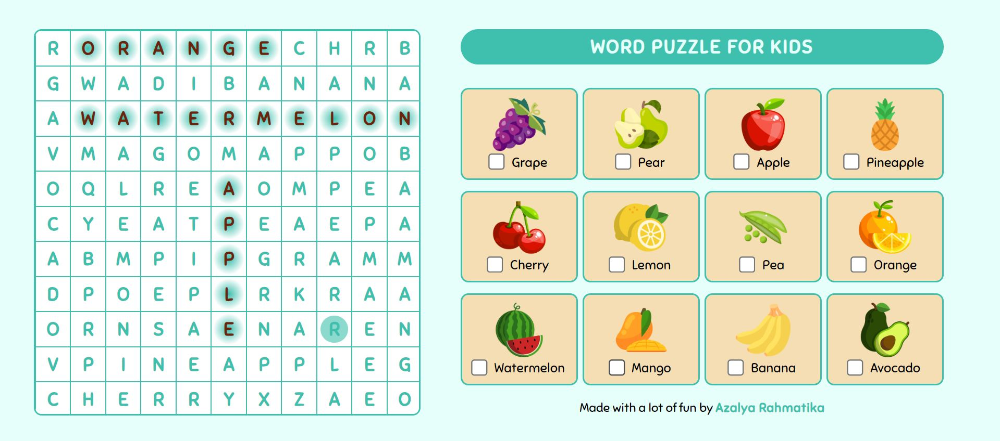

# Word Puzzle Game

Welcome to Word Puzzle Game! This game challenges your word-finding skills as you locate hidden words among random letters on the left side of the screen.

## How to Play

1. **Start the Game:**
   - Launch the game application.

2. **Game Interface:**
   - On the left side of the screen, you will see a grid filled with random letters.
   - On the right side, a list of words (e.g., apple, watermelon) is displayed.

3. **Finding Words:**
   - Scan the grid on the left to find the words listed on the right.

4. **Marking Words:**
   - When you find a word in the grid, press the spacebar to mark each letter box of the word.
   - Cross out the corresponding word on the right to signify that it has been found.

5. **Completing the Puzzle:**
   - Continue finding and marking words until you have identified all the words on the right.

6. **Victory:**
   - Congratulations! You've completed the word puzzle. Enjoy your victory!

## Controls

- **Spacebar:** Mark the letters of the discovered word.

## Game Features

- Engaging word puzzle gameplay.
- Randomized letter grids for endless replayability.
- Intuitive controls for marking words.
- Interactive UI to enhance the gaming experience.

## Where to Play

Play the game online by accessing the [GitHub page](https://azalyarahmatika.github.io/word-puzzle/).

## Credits

- Game developed by [Your Game Development Studio/Your Name].
- Special thanks to [Any contributors or resources you want to acknowledge].

## Support

If you encounter any issues or have feedback, please contact [your email or support page].
